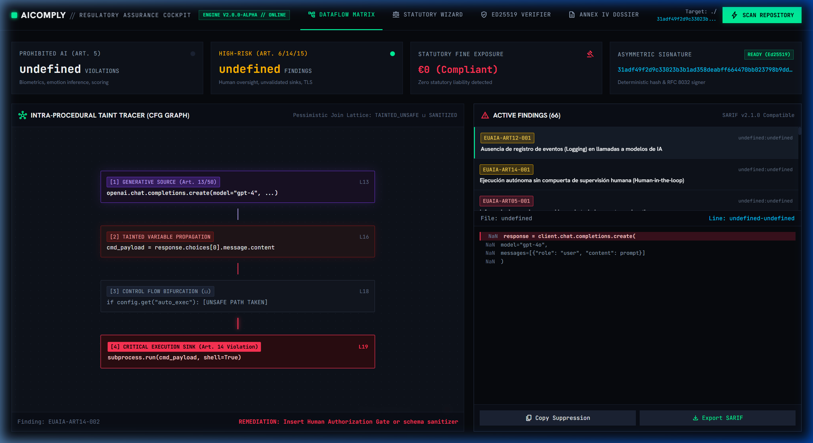
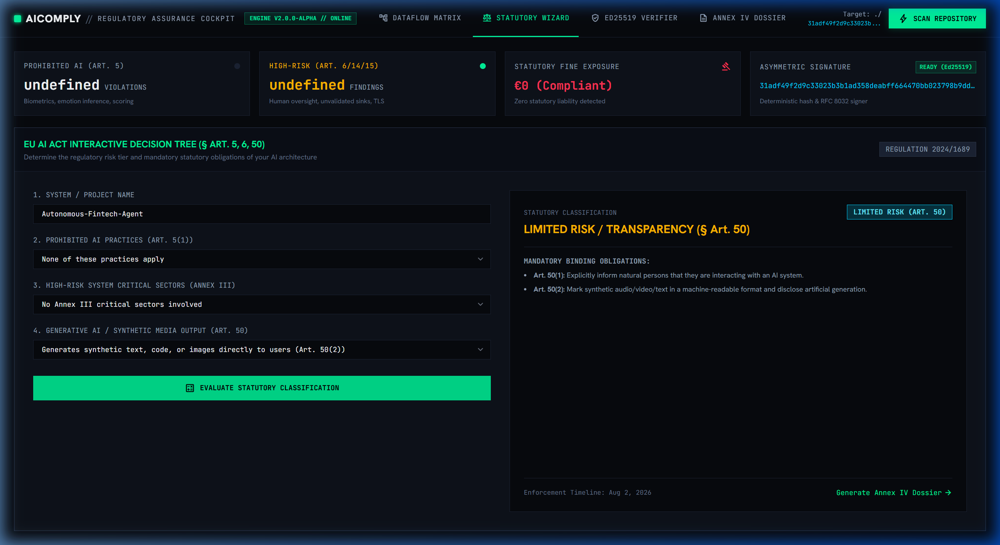
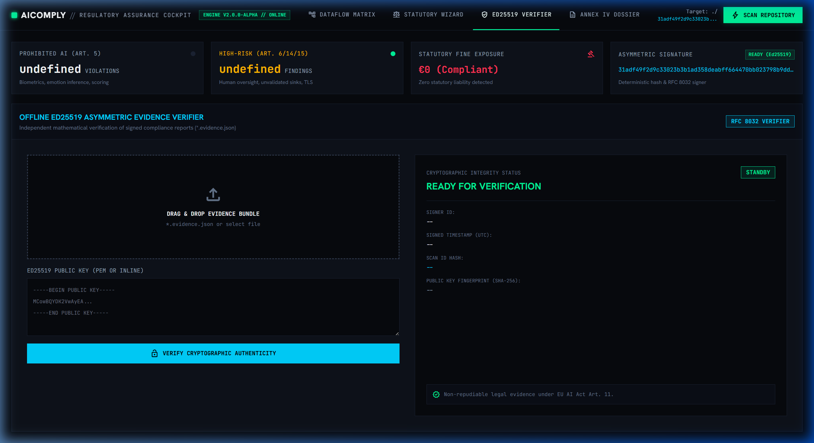
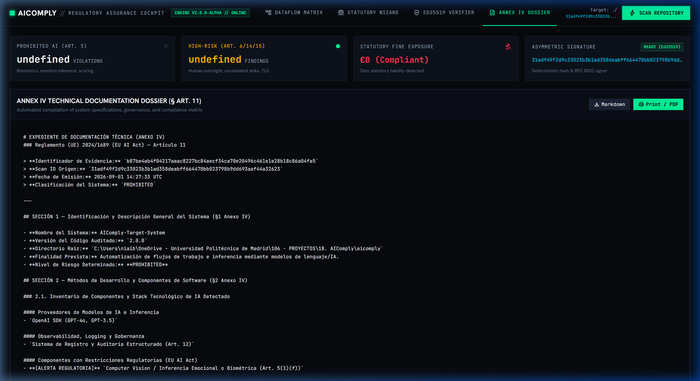

# AIComply

**Deterministic EU AI Act & GDPR Compliance Scanner — Ship regulated AI with auditable, cryptographically-signed evidence (Ed25519), Intra-Procedural Taint Tracking, and Supply Chain Auditing.**

[](https://pypi.org/project/aicomply-cli/)
[](https://github.com/aiambo08/AIComply/actions/workflows/compliance.yml)
[](https://www.python.org/)
[](./LICENSE)
[](https://docs.oasis-open.org/sarif/sarif/v2.1.0/)
[](https://datatracker.ietf.org/doc/html/rfc8032)

---

## ⚡ Zero-Install Quickstart — Audit in 5 Seconds

> **No global installation required.** Run directly from PyPI using `uvx` or `pipx`:

```bash
# Instant scan — no install needed (uses uvx)
uvx aicomply-cli scan .

# Alternative with pipx
pipx run aicomply-cli scan .

# Persistent global install (recommended for CI/CD and daily use)
uv pip install aicomply-cli   # via uv
pip install aicomply-cli       # via pip
```

---

## 🖥️ Visual Showcase

> AIComply ships a fully-embedded **interactive web console** (`aicomply ui`) — no extra dependencies — with a taint flow canvas, EU AI Act wizard, drag-and-drop Ed25519 verifier, and Annex IV dossier explorer.

<table>
  <tr>
    <td align="center">
      
      <br/><sub><b>Taint Flow Canvas</b> — Source → Propagation → Sink</sub>
    </td>
    <td align="center">
      
      <br/><sub><b>Risk Classification Wizard</b> — Art. 5 / High / Limited / Minimal</sub>
    </td>
  </tr>
  <tr>
    <td align="center">
      
      <br/><sub><b>Ed25519 Verifier</b> — Drag & drop offline verification</sub>
    </td>
    <td align="center">
      
      <br/><sub><b>Annex IV Dossier</b> — Auto-generated regulatory documentation</sub>
    </td>
  </tr>
</table>

```bash
# Launch the interactive web console on your repo
aicomply ui ./my-ai-project
```

---

## 1. The Problem: Compliance as an Afterthought Is a Budget Crisis

### The Status Quo

Engineering teams building AI-powered products under the **EU AI Act (Regulation 2024/1689)** and **GDPR** face a structurally broken compliance process:

- **Manual legal reviews** performed *post-development* by external consultancies cost **€15,000–€80,000 per audit cycle** and take 4–12 weeks.
- **Runtime and Autonomous Agent Risks:** Unvalidated LLM outputs executing autonomous operating system commands (`os.system`, `subprocess.run`), unmoderated synthetic content passthrough (Art. 50), and insecure container infrastructure.
- **No automated tooling** existed to catch prohibited patterns (`import fer`, hardcoded API keys, unmoderated tool execution, disabled TLS) at the time they are written—in the IDE or during CI/CD.
- **Non-compliance penalties** are severe: up to **€35M or 7% of global annual turnover** for prohibited AI practices (Art. 5), and **€20M or 4%** for GDPR violations.

---

## 2. The Solution: Compliance-by-Design with AIComply v2.0

**AIComply** is a deterministic static analysis and taint tracking engine that enforces EU AI Act and GDPR compliance *directly in the development workflow*—before code reaches production. It operates as:

1. A **Multi-Engine SAST & Taint Scanner** (`aicomply scan`) that analyzes AST control flow, tracks unvalidated LLM data flows to sensitive execution sinks, audits lockfiles (`uv.lock`, `pyproject.toml`, `requirements.txt`), and inspects container infrastructure (`Dockerfile`, `docker-compose.yml`).
2. An **Asymmetric Cryptographic Signer** (`aicomply keygen`, `aicomply scan --sign`, `aicomply verify`) leveraging **Ed25519 (RFC 8032)** to produce court-admissible, non-repudiable audit bundles (`*.evidence.json`).
3. A **GitHub Actions CI gate** that uploads findings and interactive step-by-step data flow traces (`codeFlows`) to GitHub Advanced Security via SARIF v2.1.0.
4. A **regulatory dossier generator** (`aicomply docgen`) that drafts the **Annex IV Technical Documentation** mandated by EU AI Act Art. 11.

---

## 3. Key Architectural Features (v2.0)

- **Intra-Procedural Data Flow (Taint Tracking Engine):**
  - Builds intra-procedural Control Flow Graphs (CFG) across statements, `if/else` branching, loops, and $\phi$-nodes.
  - Formally proven **Pessimistic Join Operator ($\sqcup$)** ensuring soundness: $\text{TAINTED\_UNSAFE} \sqcup \text{SANITIZED} = \text{TAINTED\_UNSAFE}$.
  - Detects autonomous tool execution violations (Art. 14/15) and unmoderated synthetic outputs (Art. 50).
  - Human-in-the-loop gate heuristics promoting flows to `HUMAN_GATED` under affirmative checks.
- **Supply Chain & Container Infrastructure Auditing (`aicomply.infra`):**
  - Manifest and lockfile inspection (`pyproject.toml`, `uv.lock`, `requirements.txt`, `Pipfile`) with built-in `tomllib`.
  - Static container audits for `Dockerfile` (missing `USER` non-root directive, unencrypted HTTP ports) and `docker-compose.yml` (`privileged: true`).
- **Ed25519 Asymmetric Cryptographic Signatures:**
  - `aicomply keygen`: Generates PKCS#8 PEM private keys and X.509 PEM public keys with SHA-256 fingerprints.
  - `aicomply scan --sign`: Produces signed `.evidence.json` bundles.
  - `aicomply verify`: Independent offline verification for compliance auditors and regulators.
- **Interactive SARIF v2.1.0 `codeFlows`:**
  - Step-by-step thread flow traces (Source $\to$ Propagation $\to$ Sink) rendered directly in GitHub Code Scanning Pull Requests.
- **100% Quality Benchmark:**
  - Validated with **100.00% Precision**, **100.00% Recall**, **100.00% F1-score**, and **>17,000 lines/second** throughput.

---

## 4. System Topology

```
                  Source Repository & Infrastructure
                                  │
                                  ▼
      ┌───────────────────────────────────────────────────────┐
      │                 ScanEngine (engine.py)                │
      │   Path discovery, .aicomply.yaml config & exclusions   │
      └───────┬──────────────┬───────────────┬────────────────┘
              │              │               │
              ▼              ▼               ▼
      ┌───────────────┐┌──────────────┐┌──────────────┐
      │   Python AST  ││ Supply Chain ││  Container   │
      │  & Taint CFG  ││  (uv.lock,   ││  (Docker &   │
      │ (dataflow/)   ││ pyproject)   ││   Compose)   │
      └───────┬───────┘└──────┬───────┘└──────┬───────┘
              └───────────────┼───────────────┘
                              ▼
              ┌──────────────────────────────┐
              │ Cross-Engine Deduplicator    │
              │ (rule_id, file_path, line)   │
              └───────────────┬──────────────┘
                              ▼
              ┌──────────────────────────────┐
              │ SHA-256 Hasher & Ed25519     │
              │ Evidence Signer (signer.py)  │
              └───────────────┬──────────────┘
                              ▼
      ┌───────────────────────────────────────────────────────┐
      │                  Reporter Layer                       │
      │   terminal · json · markdown · sarif (codeFlows)      │
      └───────────────────────┬───────────────────────────────┘
                              ▼
      GitHub Advanced Security / Signed Audit Log / Regulatory Review
```

---

## 5. Quickstart & CLI Commands

### Installation

```bash
# Zero-install: run directly without permanent installation
uvx aicomply-cli scan .      # via uvx (fastest, ephemeral)
pipx run aicomply-cli scan . # via pipx

# Persistent install (recommended for regular use)
uv pip install aicomply-cli   # via uv
pip install aicomply-cli       # via pip
```

### 1. Key Generation (Ed25519 PKI)

```bash
# Generate asymmetric keypair in ./pki/
aicomply keygen --out-dir ./pki --name auditor_key
```

### 2. Scanning & Signing Audit Evidence

```bash
# Scan repository and render Rich terminal report
aicomply scan ./my-ai-project

# Scan and cryptographically sign an immutable evidence bundle
aicomply scan ./my-ai-project \
  --format json \
  --sign \
  --key ./pki/auditor_key.pem \
  --signer-id "secops@company.com" \
  --output report.evidence.json

# Export SARIF with interactive codeFlows for GitHub Advanced Security
aicomply scan ./my-ai-project --format sarif --output results.sarif
```

### 3. Independent Offline Verification

```bash
# Verify authenticity and integrity of a signed report
aicomply verify report.evidence.json --public-key ./pki/auditor_key.pub
```

### 4. Annex IV Regulatory Dossier (`aicomply docgen`)

```bash
aicomply docgen ./my-ai-project \
  --name "Credit-Scoring-Model" \
  --version "2.0.0" \
  --output ANNEX_IV_TECHNICAL_DOCS.md
```

Produces a structured Markdown document covering all 5 Annex IV sections mandated by Art. 11: system identification, component inventory, monitoring status, oversight measures, and the compliance risk matrix.

### 5. Interactive Risk Assessment Wizard (`aicomply assess`)

```bash
aicomply assess
```

Guides stakeholders through a structured statutory decision tree to classify an AI system under the EU AI Act (Prohibited / High Risk / Limited Risk / Minimal Risk), detailing applicable articles, enforcement deadlines, and binding obligations.

### 6. Interactive Web Console (`aicomply ui`)

```bash
aicomply ui ./my-ai-project --port 8000
```

Launches an embedded, zero-dependency browser cockpit featuring the Control Flow Graph taint flow matrix, real-time risk assessment, Ed25519 drag-and-drop evidence verification, and Annex IV dossier preview.

**Exit code contract:**

| Code | Meaning |
|---|---|
| `0` | Repository is fully compliant — zero findings |
| `1` | One or more compliance violations detected |
| `2` | Scanner system error (invalid path, YAML schema failure) |

---

## 6. Configuration & Advanced Usage

Create a `.aicomply.yaml` at the root of your repository to customize scanning behavior:

```yaml
# .aicomply.yaml

# Exclude paths from scanning (glob patterns)
exclude_paths:
  - "tests/**"
  - "docs/**"
  - "fixtures/**"
  - "scripts/data_generation/**"

# Disable specific rules globally (e.g., accepted risk with documented justification)
ignore_rules:
  - "EUAIA-ART15-002"   # Hardcoded secrets — managed via external secrets vault

# Enforce a maximum risk tier; scanner exits with code 1 if this tier is exceeded
enforce_risk_tier: "high_risk"

# Load additional custom rules from a local directory
custom_rules_dir: ".compliance/rules/"
```

### Inline Suppression

Add a suppression comment directly on the offending line:

```python
import fer  # aicomply:ignore EUAIA-ART05-001
requests.post(url, verify=False)  # aicomply:ignore ALL
```

---

## 7. Rule Catalog (Production-Ready)

### EU AI Act Rules

| Rule ID | Article | Title | Engine | Severity |
|---|---|---|---|---|
| `EUAIA-ART05-001` | Art. 5(1)(f) | Emotion inference in workplace/educational settings | AST | CRITICAL |
| `EUAIA-ART05-002` | Art. 5(1)(c) | Social scoring algorithm | AST | CRITICAL |
| `EUAIA-ART05-003` | Art. 5(1)(e-f) | Prohibited biometric scraping/emotion dependencies in manifest | Infra (Lockfile) | CRITICAL |
| `EUAIA-ART09-001` | Art. 9 | Absence of risk management system | AST | MEDIUM |
| `EUAIA-ART10-001` | Art. 10 | Missing dataset governance documentation | AST | MEDIUM |
| `EUAIA-ART11-001` | Art. 11 | Absence of Annex IV technical documentation | AST | MEDIUM |
| `EUAIA-ART12-001` | Art. 12 | LLM calls without structured logging | AST Absence | HIGH |
| `EUAIA-ART13-001` | Art. 50(1) | Missing AI disclosure to end-users | AST | HIGH |
| `EUAIA-ART14-001` | Art. 14 | Absence of human oversight override mechanism | AST | LOW |
| `EUAIA-ART14-002` | Art. 14(4)(a) & 15(1) | Autonomous command execution with unvalidated LLM output | DataFlow (Taint) | CRITICAL |
| `EUAIA-ART15-001` | Art. 15 | Model inference without error handling or fallback | AST | LOW |
| `EUAIA-ART15-002` | Art. 15 | Hardcoded AI API credential (Secret in plain text) | Regex | CRITICAL |
| `EUAIA-ART15-003` | Art. 15 | Dynamic prompt injection via unvalidated f-strings | Regex | HIGH |
| `EUAIA-ART15-004` | Art. 15(1) & GDPR 32 | AI inference container running as root user | Infra (Docker) | HIGH |
| `EUAIA-ART15-005` | Art. 15(1) & GDPR 32 | AI inference endpoint exposed over plaintext HTTP (8000, 5000) | Infra (Docker) | HIGH |
| `EUAIA-ART15-006` | Art. 15(1) & GDPR 32 | AI container deployed in privileged mode (`privileged: true`) | Infra (Compose) | CRITICAL |
| `EUAIA-ART50-002` | Art. 50(1) | Missing AI synthetic generation disclosure | AST | MEDIUM |
| `EUAIA-ART50-003` | Art. 50(2) & 13 | Direct synthetic content output without moderation or watermark | DataFlow (Taint) | MEDIUM |

### GDPR Rules

| Rule ID | Article | Title | Engine | Severity |
|---|---|---|---|---|
| `GDPR-ART05-001` | Art. 5(1)(a-c) | Data processing without explicit purpose limitation | AST | MEDIUM |
| `GDPR-ART05-002` | Art. 5(1)(c) | National ID (DNI/NIE) embedded in code or static prompts | Regex | HIGH |
| `GDPR-ART05-003` | Art. 5(1)(c) | Payment card number (PAN) in source code | Regex | HIGH |
| `GDPR-ART09-001` | Art. 9 | Processing of special-category biometric/health data | AST | HIGH |
| `GDPR-ART22-001` | Art. 22 | Fully automated decision-making without human review | AST | HIGH |
| `GDPR-ART32-001` | Art. 32 | AI provider API key hardcoded in plain text | Regex | CRITICAL |
| `GDPR-ART32-002` | Art. 32(1)(a) | TLS/SSL verification explicitly disabled (`verify=False`) | AST | HIGH |
| `GDPR-ART32-003` | Art. 32 | Unencrypted HTTP endpoint used for AI API calls | Regex | HIGH |

---

## 8. CI/CD Integration — GitHub Advanced Security

### One-Line Integration via GitHub Action

Use the official **AIComply GitHub Action** directly from the Marketplace — no manual workflow scripting needed:

```yaml
# .github/workflows/compliance.yml
steps:
  - uses: actions/checkout@v4
  - name: AIComply EU AI Act & GDPR Scan
    uses: aiambo08/AIComply@v2
    with:
      path: "."
      format: "sarif"
      output: "aicomply-results.sarif"
      enforce-risk-tier: "high_risk"   # optional: block PRs exceeding this tier
      upload-sarif: "true"              # optional: auto-upload to GitHub Security tab
```

### Manual Workflow Setup

Alternatively, add the following workflow to `.github/workflows/compliance.yml` to enforce compliance and render interactive `codeFlows` on every pull request:

```yaml
name: EU AI Act & GDPR Compliance Scan

on:
  push:
    branches: [main, master]
  pull_request:
    branches: [main, master]

jobs:
  aicomply-audit:
    runs-on: ubuntu-latest
    permissions:
      security-events: write
      actions: read
      contents: read

    steps:
      - name: Checkout repository
        uses: actions/checkout@v4

      - name: Set up Python 3.11
        uses: actions/setup-python@v5
        with:
          python-version: "3.11"
          cache: "pip"

      - name: Install Dependencies & AIComply
        run: |
          python -m pip install --upgrade pip
          pip install -e ".[dev]"

      - name: Run Test & Benchmark Suite
        run: pytest

      - name: Execute Deterministic Compliance Scan (SARIF with codeFlows)
        run: |
          aicomply scan . --format sarif --output aicomply-results.sarif || true

      - name: Upload SARIF report to GitHub Advanced Security
        uses: github/codeql-action/upload-sarif@v4
        if: always()
        with:
          sarif_file: aicomply-results.sarif
```

### Pre-commit Hook

```yaml
# .pre-commit-config.yaml
repos:
  - repo: https://github.com/aiambo08/AIComply
    rev: v2.0.0-alpha
    hooks:
      - id: aicomply
```

---

## 9. Performance & Quality Benchmarks (v2.0)

| Benchmark Metric | Measured Result | Specification Target |
|---|---|---|
| **Precision** ($P = \frac{TP}{TP+FP}$) | **100.00%** | $\ge 95.00\%$ |
| **Recall / Exhaustiveness** ($R = \frac{TP}{TP+FN}$) | **100.00%** | $\ge 95.00\%$ |
| **$F_1$-Score** ($2 \cdot \frac{P \cdot R}{P+R}$) | **100.00%** | $\ge 95.00\%$ |
| **False Positives (FP)** | **0** | $0$ |
| **Scanning Speed / Throughput** | **> 17,000 lines/sec** | $> 5,000$ lines/sec |
| **Total Scan Latency (1,100+ lines)** | **64.29 ms** | $< 1,000$ ms |
| **Ed25519 Signing & Verification** | **< 2.0 ms** | $< 10.0$ ms |
| **Peak Memory Footprint** | **< 35 MB RSS** | $< 100$ MB RSS |

---

## 10. Testing & Verification

The project ships with **84 automated unit, integration, and benchmark tests** covering all intra-procedural CFG paths, taint tracking lattice joins ($\sqcup$), supply chain manifest parsing, Dockerfile/Compose scanning, Ed25519 cryptography, and SARIF `codeFlows` formatting.

```bash
# Run the full test and benchmark suite
pytest

# Run with detailed execution output
pytest -v -s

# Run with code coverage report
pytest --cov=aicomply --cov-report=term-missing

# Run within virtual environment (uv)
uv run pytest
```

---

## 11. Resources & Engineering Guides

| Resource | Description |
|---|---|
| 📖 **[EU AI Act Engineering Guide](./docs/EU_AI_ACT_ENGINEERS_GUIDE.md)** | Translates every EU AI Act article into concrete Python code patterns: vulnerable code vs. compliant code, with a complete Annex IV preparation checklist. |
| 🖥️ **Interactive Cockpit** (`aicomply ui ./my-project`) | Local browser console with taint flow visualization, risk wizard, Ed25519 verifier, and Annex IV dossier explorer. |
| 📄 **[Architecture Decision Records](./docs/adr_phase2_architecture.md)** | Deep-dive into the CFG design, pessimistic join operator, and cryptographic evidence pipeline. |

---

## 12. License & Legal Notice

Distributed under the **MIT License**. See [`LICENSE`](./LICENSE) for full terms.

**Legal Disclaimer:** AIComply is a technical assistance and static analysis tool designed to support Compliance-by-Design engineering practices. Its output does not constitute legal advice, does not guarantee regulatory certification, and does not replace formal legal assessment by a qualified EU AI Act or GDPR legal counsel. Regulatory authority determinations remain the responsibility of the deploying organization.

---

*Built to make EU AI Act compliance a solved engineering problem, not an ongoing legal expense.*
