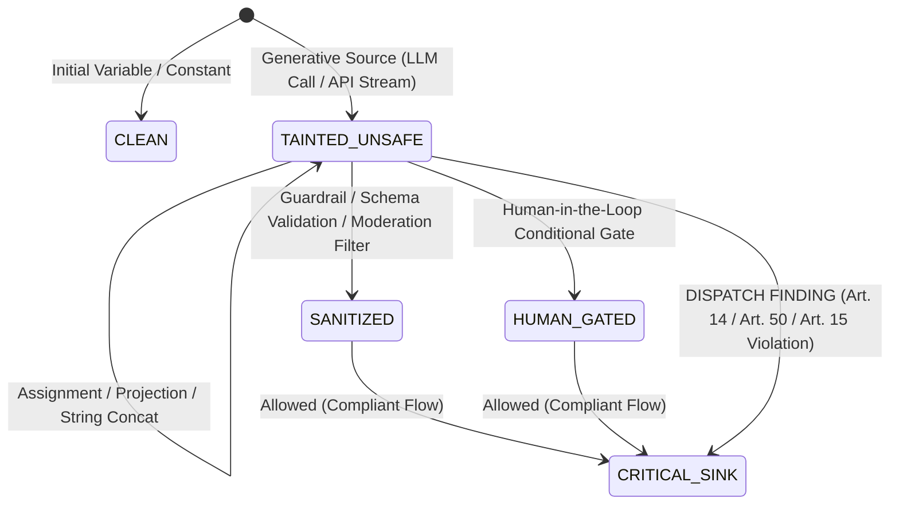
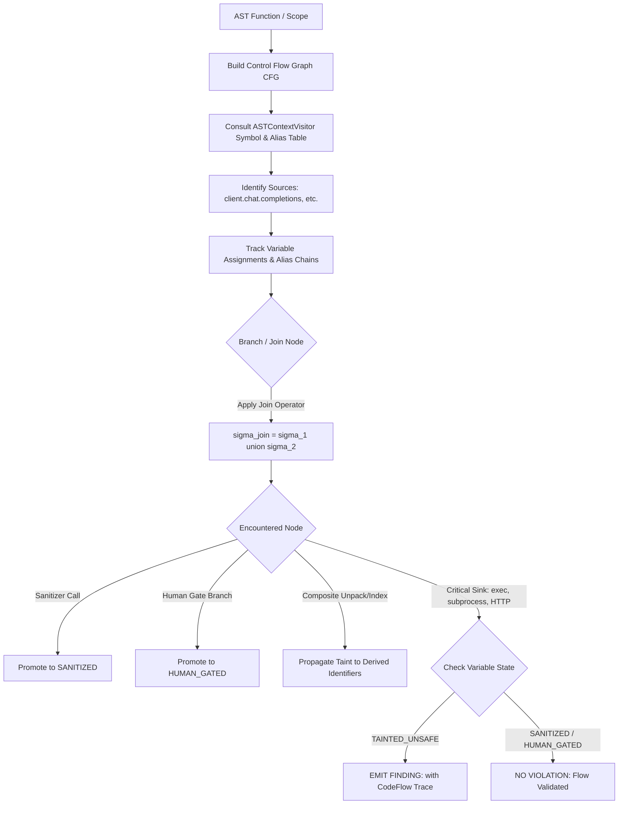
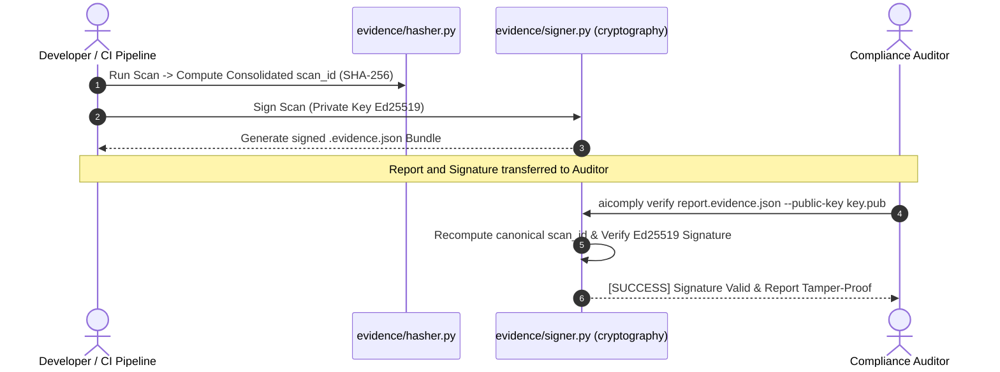
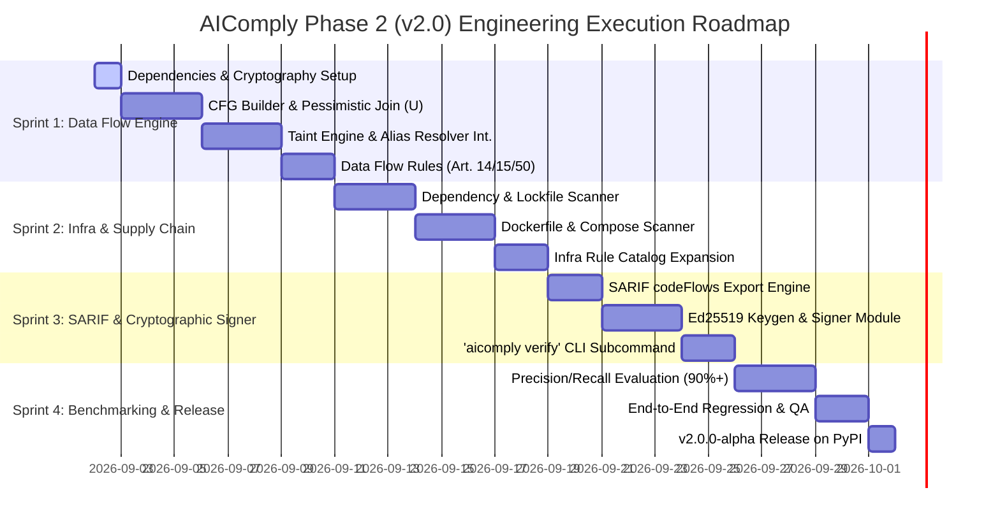

# ADR 002: Architecture Decision Record — Phase 2 (AIComply v2.0)
**Status:** Approved / In Design  
**Date:** 2026-09-01  
**Author:** Principal SAST Architect & Compiler Engineer (AIComply Core Team)  
**Target Version:** v2.0.0-alpha  
**Supersedes:** Phase 1 Baseline (v0.1.0)

---

## 1. Context & Problem Statement

In **Phase 1 (v0.1.0)**, AIComply established a deterministic, high-performance static analysis foundation based on Abstract Syntax Tree (`ast.NodeVisitor`) pattern matching, regular expression evaluation, immutable Pydantic v2 schemas, cryptographic SHA-256 evidence hashing, and multi-format reporting (Terminal Rich, JSON, Markdown, SARIF v2.1.0).

While Phase 1 effectively detects isolated API invocations, missing logging wrappers (`ast_absence`), and textual leakages, modern AI applications introduce complex runtime risks under the **EU AI Act (Regulation 2024/1689)** and **GDPR**:
1. **Autonomous Tool Execution (Art. 14 / Art. 15):** Generative AI outputs propagating directly into execution sinks (`os.system`, `subprocess.run`, SQL drivers, HTTP clients) without intermediate validation or human-in-the-loop gates.
2. **Unmoderated & Synthetic Outputs (Art. 50(1) / Art. 50(2)):** Direct exposure of LLM-generated text or media to end-users without watermarking, synthetic disclaimers, or guardrail filtering.
3. **Automated Binding Decisions (Art. 14 / GDPR Art. 22):** Deterministic propagation of high-stakes AI classifications into automated business actions without human oversight mechanisms.
4. **Supply Chain & Deployment Posture (Art. 15 / GDPR Art. 32):** Insecure container configurations (plaintext HTTP inference, root execution) and vulnerable or undeclared AI dependency lockfiles.
5. **Auditor-Grade Evidence Verification:** Need for non-repudiable, tamper-proof asymmetric signatures (Ed25519) enabling independent offline verification by regulatory bodies and compliance committees.

To address these challenges, **Phase 2 (v2.0)** transitions AIComply from an isolated call-pattern analyzer into an **Intra-Procedural Data Flow (Taint Tracking) and AI Infrastructure Security Engine**, targeting **>90% detection precision** with strict zero-regression guarantees.

---

## 2. Theoretical Modeling of the Taint Tracking Engine



### 2.1 Formal State Machine & Pessimistic Join Operator ($\sqcup$)

Let $V = \{v_1, v_2, \dots, v_n\}$ be the set of variables in an intra-procedural scope $\mathcal{S}$.  
The taint state function $\sigma: V \to \Sigma$ maps each variable to a state in the security lattice $\langle \Sigma, \sqsubseteq, \sqcup \rangle$:

$$\Sigma = \{\bot \text{ (CLEAN)}, \text{HUMAN\_GATED}, \text{SANITIZED}, \text{TAINTED\_UNSAFE}\}$$

with risk partial ordering:

$$\bot \text{ (CLEAN)} \sqsubset \text{HUMAN\_GATED} \equiv \text{SANITIZED} \sqsubset \text{TAINTED\_UNSAFE}$$

1. **`CLEAN` ($\bot$):** Static literals, deterministic system variables, or non-AI inputs.
2. **`TAINTED_UNSAFE`:** Unvalidated data originating from an unconstrained Generative AI source (e.g., `client.chat.completions.create()`, `anthropic.messages.create()`, `model.generate()`).
3. **`SANITIZED`:** Tainted data that has successfully traversed a recognized programmatic sanitizer (e.g., `guardrails.validate()`, `PydanticModel.model_validate_json()`, `openai.moderations.create()`, regex validation).
4. **`HUMAN_GATED`:** Execution path conditionally guarded by an explicit human authorization check (e.g., `if human_approved:`, `if review_status == 'ACCEPTED':`).

#### Formal Convergence at CFG Branching & Join Points (if/else $\phi$-nodes):
In order to guarantee strict soundness and prevent security bypasses, state convergence across branching paths is governed by a **pessimistic join operator ($\sqcup$)**:

$$\begin{array}{c|cccc}
\sqcup & \text{CLEAN} & \text{HUMAN\_GATED} & \text{SANITIZED} & \text{TAINTED\_UNSAFE} \\
\hline
\text{CLEAN} & \text{CLEAN} & \text{HUMAN\_GATED} & \text{SANITIZED} & \mathbf{TAINTED\_UNSAFE} \\
\text{HUMAN\_GATED} & \text{HUMAN\_GATED} & \text{HUMAN\_GATED} & \text{SANITIZED} & \mathbf{TAINTED\_UNSAFE} \\
\text{SANITIZED} & \text{SANITIZED} & \text{SANITIZED} & \text{SANITIZED} & \mathbf{TAINTED\_UNSAFE} \\
\text{TAINTED\_UNSAFE} & \mathbf{TAINTED\_UNSAFE} & \mathbf{TAINTED\_UNSAFE} & \mathbf{TAINTED\_UNSAFE} & \mathbf{TAINTED\_UNSAFE}
\end{array}$$

$$\text{TAINTED\_UNSAFE} \sqcup \text{SANITIZED} = \text{TAINTED\_UNSAFE}$$

> **Soundness Invariant:** A sensitive execution sink is marked safe **if and only if 100% of the active control-flow paths** reaching the sink node evaluate to $\text{SANITIZED}$ or $\text{HUMAN\_GATED}$.

### 2.2 Integration with Phase 1 Semantic Alias & Symbol Resolver

The Taint Engine directly reuses the symbol and alias resolution tables constructed by `ASTContextVisitor` in Phase 1:
- Resolves aliased imports (`from openai import AsyncOpenAI as AI`, `import anthropic as ant`).
- Resolves local client instantiations (`client = OpenAI()`, `self.ai_client = Anthropic()`).
- Invocations such as `client.chat.completions.create()`, `self.ai_client.messages.create()` or `llm.invoke()` automatically resolve against canonical YAML source definitions (`openai.chat.completions.create`, `anthropic.messages.create`), eliminating duplicated AST logic.

### 2.3 Taint Propagation Algorithm



#### Propagation Rules across Expressions:
- **Direct Assignment ($v_2 = v_1$):** If $\sigma(v_1) = \text{TAINTED\_UNSAFE}$, then $\sigma(v_2) \leftarrow \text{TAINTED\_UNSAFE}$.
- **Attribute Access ($v_2 = v_1.\text{choices}[0].\text{message}.\text{content}$):** Traversal of attributes or subscripts preserves the taint state:
  $$\sigma(\text{Attr}(v_1, a)) = \sigma(v_1)$$
- **String Formatting & Operations ($v_2 = f"\dots \{v_1\} \dots"$ or $v_1 + s$):** Any expression containing at least one `TAINTED_UNSAFE` operand propagates taint to the result.
- **Dictionary / Container Projection ($v_2 = \{"\text{payload}": v_1\}$):** If any element or value is tainted, accessing or passing the container to an untyped sink retains taint status.

---

## 3. YAML Data Flow & Infrastructure Rule Specification

To support data flow and infrastructure checks without altering the core declarative philosophy, the `RulePattern` schema is extended with backward compatibility.

### 3.1 Extended Pydantic v2 Schema (`schemas.py`)

```python
class PatternType(str, Enum):
    # Phase 1 Syntactic & Regex
    AST_CALL = "ast_call"
    AST_IMPORT = "ast_import"
    AST_ASSIGNMENT = "ast_assignment"
    AST_FUNCTION_DEF = "ast_function_def"
    AST_ABSENCE = "ast_absence"
    REGEX = "regex"
    
    # Phase 2 Advanced Engines
    DATA_FLOW = "data_flow"                # Source -> Sanitizer -> Sink tracking
    INFRA_DEPENDENCY = "infra_dependency"  # Lockfile / manifest auditing
    INFRA_DOCKER = "infra_docker"          # Dockerfile / docker-compose scanning


class DataFlowSource(BaseModel):
    target: str = Field(..., description="Function/method call generating tainted data")
    return_identifiers: List[str] = Field(default_factory=list, description="Explicit attribute paths tainted")


class DataFlowSanitizer(BaseModel):
    target: str = Field(..., description="Function, method or pattern that sanitizes the taint")
    sanitizer_type: str = Field(default="moderation", description="moderation | schema_validation | human_gate")


class DataFlowSink(BaseModel):
    target: str = Field(..., description="Sensitive sink function or call")
    vulnerable_params: List[str] = Field(default_factory=list, description="Parameters that must not receive tainted data")


class DataFlowSpec(BaseModel):
    model_config = ConfigDict(frozen=True, extra="forbid")
    sources: List[DataFlowSource] = Field(..., min_length=1)
    sinks: List[DataFlowSink] = Field(..., min_length=1)
    sanitizers: List[DataFlowSanitizer] = Field(default_factory=list)


class RulePattern(BaseModel):
    model_config = ConfigDict(frozen=True, extra="forbid")
    type: PatternType
    target: Optional[str] = Field(default=None)
    match_args: Optional[Dict[str, Any]] = Field(default=None)
    negate: bool = Field(default=False)
    
    # Phase 2 Extensions (Optional for full backward compatibility)
    data_flow: Optional[DataFlowSpec] = Field(default=None)
    manifest_target: Optional[str] = Field(default=None)
```

### 3.2 Canonical Rule Examples

#### A. EU AI Act Art. 14 / Art. 15: Unchecked LLM Tool Invocations (`rules/eu_ai_act/art14_tool_call_taint.yaml`)
```yaml
id: EUAIA-ART14-002
article: "Art. 14(4)(a) & Art. 15(1)"
title: "Ejecución autónoma de comandos del sistema con salida de IA no validada"
severity: CRITICAL
risk_tier: high_risk
confidence: HIGH
description: "Se detectó que el contenido devuelto por un LLM se propaga directamente a funciones de ejecución de comandos (os.system, subprocess) sin pasar por filtros de validación de esquemas ni autorización humana."
remediation: "Implemente una compuerta de supervisión humana (Human-in-the-Loop) o valide la salida del LLM contra un esquema estructurado estricto (Pydantic / Regex de comandos permitidos) antes de su invocación."
max_fine: "35M€ o 7%"
patterns:
  - type: data_flow
    data_flow:
      sources:
        - target: "openai.chat.completions.create"
        - target: "anthropic.messages.create"
        - target: "litellm.completion"
      sanitizers:
        - target: "guardrails.validate"
        - target: "pydantic.BaseModel.model_validate"
        - target: "human_approval_gate"
      sinks:
        - target: "os.system"
        - target: "subprocess.run"
        - target: "subprocess.Popen"
        - target: "eval"
        - target: "exec"
```

#### B. Supply Chain & Docker Inspection (`rules/eu_ai_act/art15_container_security.yaml`)
```yaml
id: EUAIA-ART15-003
article: "Art. 15(1) & GDPR Art. 32"
title: "Contenedor de inferencia de IA ejecutándose con privilegios de root"
severity: HIGH
risk_tier: high_risk
confidence: HIGH
description: "El Dockerfile despliega un runtime de inferencia o API de IA sin definir un usuario no privilegiado (USER non-root), exponiendo la infraestructura a escalada de privilegios."
remediation: "Agregue una directiva 'USER 1000:1000' o cree un usuario dedicado para el proceso de inferencia antes del ENTRYPOINT."
max_fine: "15M€ o 3%"
patterns:
  - type: infra_docker
    target: "Dockerfile"
    match_args:
      missing_directive: "USER"
```

---

## 4. Supply Chain & Container Infrastructure Auditing (`infra/`)

### 4.1 Dependency & Manifest Engine (`infra/dependency_scanner.py`)
- **Supported Manifests:** `requirements.txt`, `pyproject.toml`, `uv.lock`, `Pipfile`.
- **Zero Heavy Dependencies:** Utilizes Python’s built-in `tomllib` (Python >= 3.11) and deterministic lockfile parsing.
- **Detections:**
  1. **Art. 5 Prohibited Dependencies:** Ingestion of unauthorized facial scraping, mass emotion recognition, or social scoring libraries (e.g., `face_recognition`, `deepface` without compliance disclosures).
  2. **Art. 15 Cybersecurity & Robustness:** Detection of critically vulnerable framework versions (e.g., known arbitrary code execution CVEs in `langchain-experimental`, `torch < 2.2` unsafe weight loading).

### 4.2 Container & Deployment Engine (`infra/docker_scanner.py`)
- **Supported Artifacts:** `Dockerfile`, `Dockerfile.*`, `docker-compose.yml`, `docker-compose.*.yaml`.
- **Detections:**
  1. **Plaintext Insecure Endpoints (GDPR Art. 32 / AI Act Art. 15):** Exposing model serving endpoints over unencrypted HTTP (e.g., `vLLM` or `Triton` exposed on `0.0.0.0:8000` without TLS termination).
  2. **Privileged Runtimes:** Docker Compose services configured with `privileged: true` or `user: root`.
  3. **Embedded Secrets:** `ENV` or `ARG` directives containing unencrypted API keys or production tokens.

---

## 5. SARIF v2.1.0 Data Flow Trace Mapping (`codeFlows`) & Ed25519 Cryptography

### 5.1 Interactive Pull Request Traversal via SARIF `codeFlows`
To enable interactive step-by-step visualizations in GitHub Advanced Security and GitLab SAST, data flow findings export complete thread flow traces:

```json
{
  "ruleId": "EUAIA-ART14-002",
  "message": { "text": "Unvalidated LLM output propagates to subprocess.run (Art. 14(4)(a))" },
  "locations": [
    {
      "physicalLocation": {
        "artifactLocation": { "uri": "src/agent.py" },
        "region": { "startLine": 28, "startColumn": 5 }
      }
    }
  ],
  "codeFlows": [
    {
      "threadFlows": [
        {
          "locations": [
            {
              "location": {
                "message": { "text": "Source: Unsafe LLM Generation via client.chat.completions.create()" },
                "physicalLocation": {
                  "artifactLocation": { "uri": "src/agent.py" },
                  "region": { "startLine": 12 }
                }
              },
              "nestingLevel": 0
            },
            {
              "location": {
                "message": { "text": "Propagation: Assigned to variable 'raw_cmd'" },
                "physicalLocation": {
                  "artifactLocation": { "uri": "src/agent.py" },
                  "region": { "startLine": 15 }
                }
              },
              "nestingLevel": 0
            },
            {
              "location": {
                "message": { "text": "Sink: Execution in subprocess.run() without schema/human gate" },
                "physicalLocation": {
                  "artifactLocation": { "uri": "src/agent.py" },
                  "region": { "startLine": 28 }
                }
              },
              "nestingLevel": 0
            }
          ]
        }
      ]
    }
  ]
}
```

### 5.2 Cryptographic Dependency Specification
- **Requirement:** Asymmetric Ed25519 digital signing (RFC 8032) is not implemented in Python's standard library `hashlib`.
- **Specification:** Add `cryptography>=42.0.0` to `pyproject.toml` dependencies, leveraging `cryptography.hazmat.primitives.asymmetric.ed25519` for constant-time, audit-grade key generation, signing, and verification.



### 5.3 Canonical Signed Bundle Format (`*.evidence.json`)

```json
{
  "version": "2.0.0",
  "algorithm": "Ed25519",
  "scan_id": "8f4b2b8d0e7f1a2b3c4d5e6f7a8b9c0d1e2f3a4b5c6d7e8f9a0b1c2d3e4f5a6b",
  "timestamp": "2026-09-01T10:00:00Z",
  "signer_identity": "secops-ci@company.com",
  "public_key_fingerprint": "SHA256:uW3...9xA",
  "payload_summary": {
    "target_path": "src/",
    "total_findings": 3,
    "overall_risk": "high_risk",
    "rule_count": 25
  },
  "signature": "base64_encoded_ed25519_signature=="
}
```

---

## 6. Migration & Backward Compatibility Strategy

| Component | Phase 1 (v0.1.0) | Phase 2 (v2.0.0) | Compatibility Guarantee |
| :--- | :--- | :--- | :--- |
| `aicomply scan` | Syntactic AST + Regex | AST + Regex + DataFlow + Infra | **100% Backward Compatible.** Default scan includes all engines seamlessly. |
| `aicomply assess` | Terminal Wizard | Enhanced Risk Matrix (v2.0) | **100% Compatible.** Seamless additions to decision trees. |
| `aicomply docgen` | Annex IV Markdown | Annex IV + Data Flow Diagrams | **100% Compatible.** Enriched architecture section. |
| Rules Format | YAML (`RulePattern`) | Extended YAML | Fully backward compatible; existing Phase 1 rules load unmodified. |
| SARIF / JSON Output | v1 Schema | Schema v2 (`codeFlows` support) | Fully backward compatible, enriched with step-by-step thread traces. |

---

## 7. Step-by-Step Implementation Roadmap



---

## 8. Architectural Consequences & Tech Lead Sign-off

- **Positive:** Mathematical soundness guaranteed by $\text{TAINTED\_UNSAFE} \sqcup \text{SANITIZED} = \text{TAINTED\_UNSAFE}$; precision elevated >90%; native interactive visualizations in GitHub PRs via SARIF `codeFlows`; enterprise cryptography via `cryptography>=42.0.0`.
- **Negative:** AST CFG building adds minor CPU overhead (mitigated by memoization and selective intra-procedural scope traversal, maintaining sub-second scan speeds for repositories <50,000 LOC).
- **Decision:** Proceed with Phase 2 implementation strictly following this refined ADR blueprint.
